# Game Development Starting Document (GDSD)
**Cosmic Ages**: Vision & Blueprint **v3.2**
**Last Updated:** September 2025

_**Lead your civilization from planetary infancy to stellar transcendence in a grand strategy game where your interface—and your responsibilities—evolve from micromanaging cities to shaping your interstellar civilization policies.**_
# 1. Executive Summary

>Cosmic Ages is a grand 4X strategy game where your civilization advances through distinct **Ages**. Real-time cadence with **SitRep** pauses keeps clarity high while the world stays alive. Distance, logistics, and imperfect information make the starfield itself the strategy.

This Game Development Starting Document establishes the foundational vision and the technical architecture for creating a deep, complex strategy experience that maintains high usability while delivering unprecedented scope and narrative depth.
It sets non‑negotiable pillars and player‑facing contracts while staying readable; deep mechanics live in  _Child_ documents.
## Index:

- **Executive Summary (1)**: Introduces the game's vision, player contract, and foundational pillars, including the core experience diagram.
	- **Inspirations**: Sources from games, media, and science that shape the design.
	- **The Player Promise**: Details the player experience, including Ages progression (with Mermaid diagram).
- **High level core Vision (2)**
- **Narrative Pillar (3)**: Focuses on storytelling, events, and LAI's role in creating memorable arcs.
- **Gameplay Pillar (4)**: Covers core mechanics, simulation layers, and strategic elements like Luxuries and combat.
- **Technical Pillar (5)**: Outlines architecture for scale, performance, and realism.
- **Systems (6)**: Describes adaptive interfaces and SitRep system.
- **Glossary & Terminology (7)**: Includes terminology, reliability tags, acronyms, and print-friendly rules.
- **Appendix A**: Lists child documents with descriptions and a Mermaid map for navigation.

\pagebreak

   
## The Contract:

This is our contract with the player: to deliver an experience that is **Fun**, **Consistent**, and **Memorable**. To honor that contract, every design decision is grounded in three foundational pillars that translate this vision into a concrete development plan.

![[CoreExperienceGPT.png]]

| **Narrative Pillar** | Memorableness (through Events, Storyline, and Art style) and Consistency (through Coherence and a believable Setting).              |
| -------------------- | ----------------------------------------------------------------------------------------------------------------------------------- |
| **Gameplay Pillar**  | Fun (through Playfulness, Ease of use, and Clarity) and Consistency (through coherent, evolving game mechanics).                    |
| **Technical Pillar** | Supports both **Fun** and **Consistency** by ensuring a seamless, responsive, and stable simulation that makes the world feel real. |

\pagebreak

## Inspirations:

### Games:
**Soren Johnson's "Sid Meier's Civilization IV"** (Ages, splash screens, general 4X feel, end-game micromanagement issues to solve), 
    
**Steve Barcia's Master of Orion** (classic space 4X), 
    
**Will Wright's SimCity** (RTS elements, organic development), 
    
**David Dunham, Greg Stafford and Robin D. Laws' King of Dragon Pass** (narrative, events), 
    
**Elliot Gibbs' Distant Worlds** (independent development, AI depth), 
    
**Johan Andersson's Hearts of Iron** (implied for tech tree depth), 
    
**Marc Miller's Traveller** tabletop role playing game (Scout service, infinite universe feel)
    
### Media:
**J. Michael Straczynski's Babylon 5** TV series (distinctive race tech/design), 
    
**Edmund Hamilton's "DoomStar"** book (conceptual for star-affecting superweapons), 
    
**Frank Herbert's Dune** series (Spice, politics), 
    
**Iain M. Banks' Culture** series (Post-scarcity AI managed civilization, black humor)
    
### Science:
**D'Alembert & Diderot's "figurative system of human knowledge"** (for knowledge system breadth), 
    
**James Lovelock's Gaia hypothesis** (living planets as self-regulating complex systems)

## Game Core Tensions

    
- **Discovery vs. Danger:** The drive to explore is constantly balanced against the risk of what you can't see.
        
- **Control vs. Delegation:** The player must always feel in command, even as direct control is abstracted into policy.
        
- **Perfect Information vs. The Fog of War:** Strategy is based on belief and interpretation, not omniscience.
        
- **Narrative vs. Simulation:** The AI crafts a story, but never breaks the rules of the simulated world.

## The Player Promise

Cosmic Ages runs with real-time cadence and regular situation reports (SitRep) pauses that _feels_ turn-based. You begin with a tactical level micromanagement and step by step move up to an end with high level political management without ever being drowned in a click feast. Discovery is bounded by distance, logistics, and the quality of information you can obtain; **what you know** (and when you know it) shapes all your plans and that of the game managed competition too. The UI never fights you and the late game favors **decisions over chores**.

*"Experience a universe that evolves alongside you, featuring dynamic gameplay that evolve through distinct historical epochs, from humble planetary beginnings to huge star cluster-spanning empire that can achieve transcendent existence beyond physical reality."*

- **Real-time with brains:** Regular **SitRep** triage pauses at meaningful moments; you tune the noise.
- **Ages that matter:** Each Age changes the tone and the scope of the game.

```mermaid
%%{init: {
  'theme': 'base',
  'themeVariables': {
    'fontSize': '50px',
    'fontFamily': 'Verdana, sans-serif'
  },
  'flowchart': {
    'nodeSpacing': 20,
    'rankSpacing': 30,
    'curve': 'basis',
    'useMaxWidth': true,
    'htmlLabels': true
  }
}}%%
graph LR
    %% Main progression as stairs
    A(["🏠<br/>Mother-planet<br/>Age."]) --> B(["🚀<br/>New Frontier<br/>Age."])
    B --> C(["🌌<br/>Colonial<br/>Age"])
    C --> D(["🏗️<br/>Foundation<br/>Age"])
    D --> E(["🌟<br/>Golden<br/>Age"])
    E --> F(["🌙<br/>Twilight<br/>Age"])
    F --> G(["📜<br/>Heritage<br/>Age"])
    
    %% Position adjustments to create stair effect
    A ~~~ A1[ ]
    B ~~~ B1[ ]
    B1 ~~~ B2[ ]
    C ~~~ C1[ ]
    C1 ~~~ C2[ ]
    C2 ~~~ C3[ ]
    D ~~~ D1[ ]
    D1 ~~~ D2[ ]
    D2 ~~~ D3[ ]
    D3 ~~~ D4[ ]
    E ~~~ E1[ ]
    E1 ~~~ E2[ ]
    E2 ~~~ E3[ ]
    E3 ~~~ E4[ ]
    E4 ~~~ E5[ ]
    F ~~~ F1[ ]
    F1 ~~~ F2[ ]
    F1 ~~~ F3[ ]
    F3 ~~~ F4[ ]
    F4 ~~~ F5[ ]
    F5 ~~~ F6[ ]
    
    %% Position F.T.L (bottom left)
    FTL["🛸<br/>F.T.L."]
    FTL ~~~ C
    
    %% Position First Contact (upper left area)
    B ~~~ FC["👽<br/>First Contact"]
    
    %% Position The A.I. crisis (lower middle)
    AI["🤖<br/>A.I. Crisis"] ~~~ E
    
    %% Position Civil War (middle area)
    D ~~~ CW["⚔️<br/>Civil War"]
    
    %% Position Singularity (upper right)
    E ~~~ S["🤯<br/>Singularity"]
    
    %% Position Virtual retreat (lower right)
    VR["🧘<br/>Virtual Retreat"] ~~~ F
    
    %% Hide spacer nodes
    style A1 fill:transparent,stroke:transparent
    style B1 fill:transparent,stroke:transparent
    style B2 fill:transparent,stroke:transparent
    style C1 fill:transparent,stroke:transparent
    style C2 fill:transparent,stroke:transparent
    style C3 fill:transparent,stroke:transparent
    style D1 fill:transparent,stroke:transparent
    style D2 fill:transparent,stroke:transparent
    style D3 fill:transparent,stroke:transparent
    style D4 fill:transparent,stroke:transparent
    style E1 fill:transparent,stroke:transparent
    style E2 fill:transparent,stroke:transparent
    style E3 fill:transparent,stroke:transparent
    style E4 fill:transparent,stroke:transparent
    style E5 fill:transparent,stroke:transparent
    style F1 fill:transparent,stroke:transparent
    style F2 fill:transparent,stroke:transparent
    style F3 fill:transparent,stroke:transparent
    style F4 fill:transparent,stroke:transparent
    style F5 fill:transparent,stroke:transparent
    style F6 fill:transparent,stroke:transparent
    
    %% Styling for ages
    style A fill:#6495ED,stroke:#333,stroke-width:2px,color:#fff
    style B fill:#6495ED,stroke:#333,stroke-width:2px,color:#fff
    style C fill:#6495ED,stroke:#333,stroke-width:2px,color:#fff
    style D fill:#6495ED,stroke:#333,stroke-width:2px,color:#fff
    style E fill:#6495ED,stroke:#333,stroke-width:2px,color:#fff
    style F fill:#6495ED,stroke:#333,stroke-width:2px,color:#fff
    style G fill:#6495ED,stroke:#333,stroke-width:2px,color:#fff
    
    %% Styling for events
    style FTL fill:#1a2a1a,stroke:#333,stroke-width:0px,color:#eaffea
    style FC fill:#1a2a1a,stroke:#333,stroke-width:0px,color:#eaffea
    style AI fill:#1a2a1a,stroke:#333,stroke-width:0px,color:#eaffea
    style CW fill:#1a2a1a,stroke:#333,stroke-width:0px,color:#eaffea
    style S fill:#1a2a1a,stroke:#333,stroke-width:0px,color:#eaffea
    style VR fill:#1a2a1a,stroke:#333,stroke-width:0px,color:#eaffea
```

- **Decisions over chores:** Mid/late game is policy, doctrine, and intent—not click spam.
- **Clarity under pressure:** A user interface that always puts at your fingertip the right tools and that makes everything easy.

> **In plain words:** _Every hour unlocks a new layer of mastery._ Early you tinker and learn; mid-run you orchestrate routes, doctrine, and diplomacy; late you define outcomes with civilization-scale projects—**and the interface keeps pace**.

\pagebreak

## Why Cosmic Ages Is Different

**Ages — the game grows up with you**
- Each **Age** reframes what you touch and how you think: from direct orders to a **single starship** to **fleet battle order** to **ministry policies and civilization-wide projects**.
    
- Age transitions are meaningful moments in the story, not hidden math-driven flips and the user interface visibly reflect it.
    

**Dynamic UI — from controls to policy**
- The interface **adapts to scale and focus**. Knobs become **policies**, lists become **dashboards**, and you can always override the default choices.
    
- While going on with the ages the capability to micromanage will be replaced by more high-level systems it never goes away: it just move in submenus to not clutter the user interface.
    
- One alert → one verb: act now, delegate, or ask for an explanation.
    
- Lenses for **economy, intel, legitimacy** highlight “what matters now.”
    

**SitRep cadence — real-time with clarity**
- Time flows in real time, but **regular or event driven SitRep pauses** triage events into importance level and let you react in an efficient way.

```mermaid
%%{init: {
  'theme': 'base',
  'themeVariables': {
    'fontSize': '15px',
    'fontFamily': 'Verdana, sans-serif'
  },
  'flowchart': {
    'nodeSpacing': 20,
    'rankSpacing': 30,
    'curve': 'basis',
    'useMaxWidth': true,
    'htmlLabels': true
  }
}}%%

flowchart TB
  %% SitRep pacing flow (compact, print-safe)

  EVT[Game event occurs] --> CLS[Classify by severity and filters]
  CLS -->|Critical| HP[Hard pause · Emergency SitRep]
  CLS -->|Major| SP[Soft pause · In evidence in the regular SitRep]
  CLS -->|Minor| BADGE[Badge only · In the event list in the regular SitRep]
  CLS -->|Info| LOG[Wrote in the log but easily available to search]

  HP --> ACTN[Player acts or delegates] --> RES[After-action notes] --> RESUME[Resume flow]
  SP --> ACTN
  BADGE --> RESUME
  LOG --> RESUME
```

- While you are in the SitRep the time slows down to one second game time to one second real time. A snail pace for an ages spanning game. During normal gameplay, time speeds up automatically. In both cases the player can always decide the ratio that he likes more and the 'speed' of the automatic speed variation. The default speed rates will be defined later in a child document and finalized after extensive playtesting.
    
- You tune the filters deciding how much you want to see and what can interrupt you while presets shift per Age to keep a similar level of request of your attention.
    
**Perception over truth**  
- The UI shows **Perceived State** with **Reliability**. Deception and error are systemic, not scripted gotchas. Your technology level and the reliability of your perception of the reality goes hand in hand.
    
- The other civilizations managed by **OAI**s (Other civilization AI) will get the same level of reality reliability than the player as only the LAI (see two paragraph down) will have access to the reality level and will use it with the only goal of make the game more engaging/enjoyable for the player.
    
**Game narrative — fair drama**
- Each playthrough is more of a story than an abstract match against rules and enemies.
    
- The game, using a dedicated AI called **LAI** (_**L**et's make each game a memorable experience  **A**rtificial **I**ntelligence_), watches both the true underlying simulation and the player (and **OAI**) perceived knowledge of the reality to **pace** opportunities and risks.
     
**Strategic-focused** — combat with realistic resolutions and post-facto analysis tools    
- The full planet face seen from space is the most zoom in view available. That will let the player manage continents and big cities but nothing more fine. Surface combat will be by definition abstract.
    
- Space combat marries realism with engagements lasting a millisecond as fleets cross at semi-relativistic speeds, emphasizing preparation, fleet composition, and post-facto analysis tools to understand what went wrong (or right...eventually).
    
**Vast starfield — distance, logistics, intel**
- The playing field is effectively unbounded, detailed **where you engage**, and light where you do not.
    
- **Distance matters:** mobility windows, comms delay, and route throughput give the map strategic texture.
    
**Interconnected Knowledge Web — five domains**
- **Theory, Technology, Application, Ethics, Aesthetics** evolve together; advances ripple across culture, doctrine, and UI lenses. They still have each one a different system and way to be managed while they at the same time influence each other.
    
- Choices create distinct intellectual identities, not just stat boosts.
    
- Research choices create **cross-domain unlocks** (e.g., a Theory leap plus Aesthetics reframes a doctrine UI).
    
- **Ethics** limits are trade-offs—not hidden punishments: they always come with positive effects.

**Luxuries and extreme materials — capability unlocks**
- Luxuries and extreme materials are not mere bonuses; they unlock unique methods (e.g., mobility modes, industries, doctrines) that reshape strategy and identity.
    
- They can be part or even protagonist of the game narrative.
    
- An extensive list of potential ones that will never be completely available in a playthrough, adding to the uniqueness of each game. Luxuries unavailable in a playthrough are excluded for all civilizations, ensuring fairness, while available Luxuries are distributed non-uniformly to create economic and strategic opportunities.
    
- LAI only adjusts access paths (events, trades); it never adds a Luxury that was seed-banned at the playing starfield generation”
    
**The 95% Competency Rule:**
- The delegated EMAI is designed to achieve approximately 95% of a dedicated human micromanager's efficiency as a development benchmark, allowing players to assess its performance through trial and error.
    
**Player-Driven Focus:**
- This design ensures players can invest their attention where they find the most enjoyment. A player can choose to fully delegate their economy to focus on intricate military campaigns, or automate their defenses to meticulously craft their civilization's cultural and technological path. The UI will adapt to these preferences, elevating the tools for the chosen focus while keeping the delegated systems running transparently in the background.
    
**Player content creation** — utilities and cloud sharing system: 
- Each game render with abundant details capital planets (especially the one of the player) and other important assets. Instead of losing them they can be uploaded to a common cloud where your game can retrieve  alien capitals etc. already rendered by other players optimizing the use of your pc resources. 
    
- An utility dedicated to event creation and/or editing/updating will be part of the game and the results  of the player creativity will, if so desired, be shared with the other players around the world.

\pagebreak

## What This Is / Isn’t

A strategic sandbox where information quality and logistics matter / **Not** a twitch tactical simulator
An UI that matures with your civilization / **Not** a fixed “one-size-fits-all” interface
A narrative AI that curates, not cheats / **Not** an opaque director that railroads outcomes
A late game focused on intent and policy / **Not** a click-heavy chore list

## Business & Development Plan
For market, audience, roadmap, and funding scope an extensive description is available in the BDPD "Business & Development Plan Document".

## One‑Page Takeaway

Cosmic Ages delivers a strategy experience where **scale is a feature, not a burden**. The **Ages** reframe your levers, the **UI** matures with you, **SitRep** keeps real-time legible, the **LAI** curates fairness and drama, the **starfield** makes distance and intel meaningful, the **Knowledge Web** turns research into culture and capability, and **Luxuries** unlock distinctive game opportunities.  
**Result:** a late game of **intent and policy**, not click-tax—_and a memorable story every run._

\pagebreak

# 2. High level core vision
### 2.1 Complexity with Usability
*"High complexity BUT & IF it is coupled with high usability"*

The game embraces deep, interconnected systems while ensuring players can understand and manipulate them effectively. Complexity emerges from all these system interactions, not from  an unfriendly user interface.

This game also go all in credible science depiction and, even when the future science extrapolations are strongly speculative, a fully coherent realistic feeling. 
When that will cause extreme complexity the game will react with a very friendly user interface and just the minimal simplification that could be needed to keep for the player an always enjoyable experience.
Advisors are available to manage the parts of the simulation that are not interesting for the player and  they can also be important actors in the overall narrative. That leave to the player to decide what they want micromanage and what they just want to supervise at the higher level.

An ai called **LAI** (**L**et's make each game a memorable experience **A**rtificial **I**ntelligence) will keep track of the player previous plays and what he liked and disliked to propose the best starting options to keep the game in line with the player expectations.
It will follow the player also during the game to make sure that surprise events are not used repeatedly and that the game do not bog down in any moment.
It will be there also after the end of the game to check if the player enjoyed it and what went right or what has been boring and keep that in its long time memory.

**A civilization that grows up across a living starfield**

```mermaid
%%{init: {
  'theme': 'base',
  'themeVariables': {
    'fontSize': '15px',
    'fontFamily': 'Verdana, sans-serif'
  },
  'flowchart': {
    'nodeSpacing': 20,
    'rankSpacing': 30,
    'curve': 'basis',
    'useMaxWidth': true,
    'htmlLabels': true
  }
}}%%

flowchart LR
  %% A4-friendly: top-to-bottom, short labels, parse-safe (no ampersands)
  classDef core fill:#eef3ff,stroke:#6b8bff,color:#111,stroke-width:1;
  classDef pillar fill:#f6fff0,stroke:#73bf73,color:#111,stroke-width:1;
  classDef leaf fill:#ffffff,stroke:#cfcfcf,color:#111,stroke-width:1;

  CORE([Core Vision]):::core

  subgraph NARR[Narrative Pillar]
  direction TB
  N1[LAI invisible<br/>hand · fair pacing]:::leaf
  N2[Event design DNA<br/>threads · reliability tags]:::leaf
  N3[Perception model<br/>no absolute reality]:::leaf
  N4[Civilizations and first contact<br/>identity · brittle protocols]:::leaf
  end

  subgraph GAME[Gameplay Pillar]
  direction TB
  G1[Ages thesis<br/>scale shifts · new verbs]:::leaf
  G2[Dynamic UI<br/>controls to policy · lenses]:::leaf
  G3[SitRep cadence<br/>real time with pauses]:::leaf
  G4[Intent over micro<br/>ministerial play · delegation]:::leaf
  G5[Economy, Logistics and Legitimacy<br/>distance · markets · taxation]:::leaf
  end

  subgraph TECH[Technical Pillar]
  direction TB
  T1[Scale and LOD<br/>lazy init · fidelity bands]:::leaf
  T2[Starfield simulation<br/>distance · logistics · intel]:::leaf
  T3[Modular and data-first<br/>contracts · schemas · hot reload]:::leaf
  T4[AI tiers<br/>SAI · EMAI · OAI · LAI guardrails]:::leaf
  end

  CORE --> NARR
  CORE --> GAME
  CORE --> TECH
```

\pagebreak

### 2.2 Narrative Pillar — what it guarantees

**Purpose.** Turn the simulation into memorable, fair drama without breaking physics or player agency.

- **LAI invisible hand** The LAI times opportunities and pressure with interventions in both **True Simulation** and **Perceived State**. LAI monitors SitRep frequency to maintain a turn-based cadence without excessive pauses, bundling Minor/Info events in high-intensity Ages unless overridden. It also ensures non-uniform Luxury distribution is balanced across Ages, with critical unlocks (e.g., mobility methods) gated by exploration or intel thresholds to prevent early dominance.   _(Child: ESDD, AIHLA, LAISD)_
    
- **Event design DNA.** Short, legible cards with clear stakes, 2–4 choices, fail-forward outcomes, and **reliability tags** that travel across Ages as **threads**. _(Child: ESDD)_
    
- **Perception over truth.** UI shows **Perceived State (UISM)** with certainty labels; deception and error are systemic, not scripted gotchas. _(Child: ESDD, UI-SPEC)_
    
- **Civilizations and first contact.** Physiology shapes worldview and doctrine; first contact is brittle by design and filtered through reliability. _(Child: ACPDD/AADD, ESDD)_
    

### 2.3 Gameplay Pillar — what it guarantees

**Purpose.** Preserve strategic agency at every scale by changing _what_ you touch as your civilization grows.

- **Ages thesis.** Each Age is a legible pivot that retires some verbs and introduces new ones, moving from direct orders to **policies and intent**. _(Child: system books by Age)_
    
- **Dynamic UI.** Lenses (economy · intel · Legitimacy) highlight “what matters now.” No control is removed without an obvious successor. _(Child: UI-SPEC)_
    
- **SitRep cadence.** Real time with **automatic pauses** by severity (Critical, Major, Minor, Info). One alert → one verb: act or delegate. _(Child: UI-SPEC)_
    
- **Intent over micro.** Ministerial play and delegation handle routine execution while keeping the player in command of goals and constraints. _(Child: UI-SPEC, CCSDD)_
    
- **Economy, Logistics and Legitimacy distance · markets · taxation**

\pagebreak

### 2.4 Technical Pillar — what it guarantees

**Purpose.** Make the world effectively unbounded yet responsive, and keep it malleable for creators.

- **Scale and LOD.** Detail appears where intent or causality demands it; otherwise it remains statistical. Under load, fidelity drops **before** input does. _(Child: TDD)_
    
- **Starfield simulation.** Distance, logistics, and intel are first-class systems that give the map strategic texture. _(Child: FTLDD, TDD)_
    
- **Modular and data-first.** Capabilities communicate through contracts and events; content is authored as data with schemas and safe hot reload. _(Child: TDD, ESDD)_
    
- **AI tiers.** **SAI** for local action, **EMAI** for sector balancing, **OAI** for managing the other civilizations and **LAI** for pacing and overall game management, each with explicit guardrails (e.g. LAI will **never** use its access to real state to provide OAI-controlled civilizations with perfect information or unfair advantages.). _(Child: AIHLA)_

\pagebreak

## 3. Narrative, World, & Tone Principles

**Promise.** A living, boundless **starfield** where distance, delay, and imperfect knowledge shape every story. Cosmic Ages aims for **epic and sober** science-fiction—occasionally playful, always respectful of player agency—guided by the maxim: **there is no absolute reality, only modeled perception.**

---

### 3.1 The World in One Breath

- A vast, layered **stellar domain** that only resolves detail where attention goes.
    
- Civilizations with **non-human physiologies and senses**, producing divergent beliefs and priorities.
    
- Travel and communication are **constrained**; **logistics and intel** are strategic constants, not chores.
    
- Culture, doctrine, and technology **co-evolve** through the Knowledge Web (Theory, Technology, Application, Ethics, Aesthetics).
    

---

### 3.2 Tone Guide (how it should feel)

|Dimension|Do|Avoid|
|---|---|---|
|Overall|Epic, curious, humane|Edgelord cynicism, grimdark for shock value|
|Science|Plausible speculation, clear costs|Magic tech with no trade-offs|
|Drama|Fair stakes, earned consequences|Opaque gotchas, arbitrary failure|
|Humor|Light relief in events and news|Jokes that undercut gravitas or mock the player|
|Voice|Precise, readable, modern|Jargon soup, lore dumps without purpose|

**Rule of thumb:** if a line could live in a mission report or a scientific brief, it likely fits; if it reads like a meme, keep it rare and in the newsfeed.

\pagebreak

### 3.3 “No Absolute Reality” (perception over truth)

- The simulation tracks a **True State** the player never fully sees.
    
- The UI presents a **Perceived State (User Interface Star Map)** built from sensors, inference, diplomacy, and rumors.
    
- Every intel item carries a **reliability tag**: **Certain (almost)**, **Probable**, **Speculative**, **Rumor**, **Unknown**.

- Distance and environment impose **lag and loss** (late telemetry, partial scans, mistranslations).
    
- **Deception and error** are systems, not scripts: decoys, spoofed traffic, biased or just honestly fallacious observers.
    
- **LAI** respects agency: it may **pace** discovery or may reveal existing contradictions but never injects data that violates physics or prior intel contracts. Its access to the True Simulation is used exclusively to create a compelling experience for the player. It never uses this knowledge to give opposing civilizations (**OAI**) hidden advantages or to subvert the rules of the simulation.

\pagebreak

While this diagram and this topic in general will get a much deeper analysis in a dedicated document here we point out the Information Quality Variables.
The quality and completeness of information displayed on the UISM depends on several key factors:

|                                                      |                                                                |
| ---------------------------------------------------- | -------------------------------------------------------------- |
| **Intelligence Funding**                             | **Diplomatic Relations**                                       |
| • Foreign intelligence funding levels                | • Quality of diplomatic relationships with other civilizations |
| • Foreign counterintelligence funding                | • Communication channel effectiveness and reliability          |
| • General intelligence budget allocation             |                                                                |
|                                                      |                                                                |
| **Sensor Capabilities**                              | **Collaboration Indexes**                                      |
| • Active sensor quality and quantity                 | • Civilian inter-civilization collaboration levels             |
| • Passive sensor coverage and accuracy               | • Inter-agency collaboration effectiveness                     |
|                                                      | • Scientific community participation rates                     |
| **Data Access**                                      | • Private sector and state collaboration index                 |
| • Private access to state data (legal and otherwise) |                                                                |
| • Information sharing protocols and restrictions     |                                                                |

The UISM represents a sophisticated intelligence aggregation system that transforms raw data from multiple sources into actionable intelligence. The system's effectiveness depends on the quality of source data, inter-agency collaboration, funding levels, and diplomatic relationships. Understanding these information pathways is crucial for optimizing intelligence gathering and processing capabilities.
**Writer’s shorthand:** “Show the map the player _thinks_ they have; let play reveal where it bends.”

\pagebreak

### 3.4 Event Design DNA (how stories are built)

**Event card contract**

- **Trigger:** clear state or trend (not arbitrary).
    
- **Frame:** 1–3 sentences; stakes up front; plain language.
    
- **Choices:** 2–4 options, each with _visible costs_, _time to resolve_, and _intel reliance_.
    
- **Outcomes:** small range with reliability notes (e.g., “80% as stated, 20% complication”).
    
- **Follow-ups:** attach **threads** that can mature across Ages (policies, doctrines, legacies).
    
- **LAI hooks:** pacing window, escalation ceiling, “respect player plan” flag.
    

**Design goals:** fail-forward outcomes, legible trade-offs, and space for player intent (delegate, delay, or dig deeper).

---

### 3.5 Civilizations, Culture & First Contact (principles)

- **Physiology drives worldview.** Senses, metabolism, and habitat inform UI emphasis and doctrine (e.g., thermal over visual overlays).
    
- **No monocultures.** Each civilization exposes **factions** with tensions; diplomacy taps into internal dynamics, not a single opinion bar.
    
- **First contact is brittle.** Language and protocol mismatch are part of the puzzle; reliability tags apply to treaties and threats.
    
- **Identity via capability.** Preferred **mobility modes** and **luxury dependencies** shape how a civ plays and how it is read by others.
    

---

### 3.6 Narrative Structures Across Ages (thesis)

- **Mother-Planet:** survival and Legitimacy; intimate consequences, fast feedback.
    
- **New Frontier:** discovery risk; comms delay becomes a character.
    
- **Colonial:** claims, routes, and unrest; the map “pushes back.”
    
- **Foundation:** doctrine and ministries; institutions remember your choices.
    
- **Golden:** power with price; ethics gates, cultural schisms.
    
- **Twilight:** outcome-framing projects; endings are authored states, not just thresholds.  
    
    _(Optional) **Heritage:** legacies that **can eventually** show up in future games._
    

\pagebreak

### 3.7 Ethics, Safety & Player Controls

- **Comfort sliders:** tone intensity, graphic descriptions, and frequency of catastrophic events.
    
- **Opt-outs:** allow redaction or softening of specific sensitive themes in event packs.
    

---

### 3.8 Art and audio role

The visual and audio design must first serve clarity and functionality, then immersion. The UI is the primary lens through which the player perceives the universe, and its evolution across Ages is a central visual narrative.
    
A deep dive into this topic will be in the AADD document.

---

### 3.9 Scientific & Narrative Authenticity

Cosmic Ages commits to thoughtful world-building that respects scientific plausibility and avoids lazy genre conventions. The game actively challenges common sci-fi clichés through:

Realistic Space Environments: Accurate representations of planetary diversity, space physics, and cosmic phenomena
Diverse Biological Systems: Unique ecosystems and biochemistries that reflect genuine scientific speculation
Complex Civilizations: Nuanced political, economic, and cultural systems that avoid oversimplification
Plausible Technologies: Internally consistent technological frameworks grounded in theoretical physics

This commitment to authenticity enhances immersion and supports the game's core philosophy of "complexity with usability" - the universe should feel genuinely alien and wondrous, not merely reskinned Earth analogues.
Note: Detailed narrative guidelines and specific trope handling are documented in the separate Narrative Design Bible (NDB), which serves as the reference for writers and content creators to ensure consistency with this vision.

\pagebreak

 

## 4. Player Experience & Ages

**Goal of this chapter:** show how a run _feels_ minute to minute, chapter to chapter, and across the full arc—how **SitRep** pacing keeps it legible—and how the **Ages** reframe your verbs without drowning you in micro. For mechanical details, see: **TRDD** (research), **FTLDD** (mobility), **ESDD** (events), **CCSDD** (conflict), **AADD/ACPDD** (civilizations), **TDD** (tech foundations).
### 4.1 Before the game start
Complete control and intelligent management.
- **Quick start:** will immediately put the player up and running in the last user save or a new game with the last configuration for the last user.
- **Granular player control:** The player  chooses a user and inside there it has full control of all options that the game exposes.
- **AI helping hand:** The LAI is able to tweak the game management user interface trying to strike a good balance of deep control and easy to use. Example: if the player never change the starting civilization planet characteristics after a while these options will move to a second level menu. 
---

### 4.2 Play Loops (three time scales)

```mermaid
%%{init: {
  'theme': 'base',
  'themeVariables': {
    'fontSize': '15px',
    'fontFamily': 'Verdana, sans-serif'
  },
  'flowchart': {
    'nodeSpacing': 20,
    'rankSpacing': 30,
    'curve': 'basis',
    'useMaxWidth': true,
    'htmlLabels': true
  }
}}%%

flowchart LR
  %% A4 portrait-friendly. Three loops, top to bottom.

  subgraph L1[Moment loop · ~60s]
    direction LR
    SENSE[SENSE<br/>intel · tooltips · overlays]
    DECIDE[DECIDE<br/>prioritize · plan]
    ACT[ACT<br/>issue orders · set policy]
    FEED[FEEDBACK<br/>SitRep · logs · visuals]
    SENSE --> DECIDE --> ACT --> FEED --> SENSE
  end

  subgraph L2[Chapter loop · ~10–20 min]
    direction LR
    EXPLORE[EXPLORE<br/>scout · survey · contact]
    ESTABLISH[ESTABLISH<br/>outposts · routes · claims]
    SECURE[SECURE<br/>defense · Legitimacy · surplus]
    PROJECT[PROJECT<br/>doctrine · projects · influence]
    EXPLORE --> ESTABLISH --> SECURE --> PROJECT --> EXPLORE
  end

  subgraph L3[Run loop · 1–2+ hours]
    direction LR
    FOUND[FOUNDATION<br/>bootstrap on homeworld]
    CONNECT[CONNECTIONS<br/>trade · treaties · networks]
    CONSOLIDATE[CONSOLIDATION<br/>institutions · sectors]
    ASCEND[ASCENT<br/>breakthroughs · wonders]
    RESOLVE[RESOLUTION<br/>win states · heritage]
    FOUND --> CONNECT --> CONSOLIDATE --> ASCEND --> RESOLVE
  end
```

**Design intent:**

- The **Moment loop** is where clarity lives (filters, overlays, tooltips).
    
- The **Chapter loop** is where momentum lives (policies, routes, institutions).
    
- The **Run loop** is where meaning lives (doctrine, wonder, legacy).
    

---

### 4.3 SitRep cadence and timeflow (promise level)

**Baseline.** Real-time progression with **automatic SitRep pauses** on significant developments. You control _how much_ interrupts you via noise filters and delegation.

**Severity tiers and defaults**

- **Critical:** existential risk, irreversible loss, or locked-choice events. **Hard auto-pause.**
    
- **Major:** combat starts, treaty windows, milestone completions. **Soft pause** (focus jumps, timer stopped; you can resume).
    
- **Minor:** routine completions, low-risk alerts. **Badge only** (no pause).
    
- **Info:** logs, flavor, low-priority AI suggestions. **Feed** (inbox/stacked).
    

**Delegation knobs**

- Route classes to **ministries** (economy, defense, science) with do/don’t-interrupt rules.
    
- Promote/demote alert types on the fly; save presets per **Age**.
    

During SitReps, long-term projects display estimated completion in relative time (e.g., ‘6 min real time at current ratio’) to maintain strategic context.

**Player Time Control:** The player has ultimate control over the game's speed. A speed control widget (e.g., a slider or +/- buttons) is always available in the UI. This controls the base time compression ratio. The 'automatic' speed variation mentioned is simply a default setting that can be overridden. During a SitRep pause, the game defaults to a 1:1 ratio, but the player can choose to accelerate time even during a pause if they wish to delegate an event and resume quickly.

**UX principles:** one alert = one verb; show impact upfront; always give a “do it for me” delegation and a “why now” note for trust.

\pagebreak

### 4.4 Ages

Each Age changes _what you touch_ and _how you think_. Triggers and full matrices live in the dedicated Age sections; here is the thesis view.

1. **Mother-Planet** — **Hands-on stewardship.** Tight loops, finite sensors, survival economics. UI favors **direct control**; Legitimacy is local.
    
2. **New Frontier** — **First reach into the stars.** Scouting, comms delays, fragile supply. UI introduces **intent markers** and expedition planning.
    
3. **Colonial** — **Multi-system administration.** Throughput and claims matter. UI adds **sector dashboards**; diplomacy and Legitimacy enter play.
    
4. **Foundation** — **Institutions and doctrine.** Ministries, policies, and sector mandates. UI emphasizes **policy over knobs**; AER battle replays aid oversight.
    
5. **Golden** — **Trade-offs at the edge.** Powerful tech and ethics constraints; luxuries gate signature capabilities. UI reveals **risk/return lenses**.
    
6. **Twilight** — **Reality-level levers.** End-states are _defined_, not just declared. UI centers **civilization-scale projects** and outcome framing.  
    
7.  _(Optional) **Heritage** — **Between-run persistence.** Legacies can show up in future games; LAI manage this, more as a novelty than an important step._
    

**Legitimacy:** Early Ages weight Security and Supply more; later Ages introduce Ethics adherence as a modifier.

**Consistent through all Ages**

- **Dynamic UI** respects player overrides; it never removes a control you rely on without an obvious replacement. Furthermore, players can typically navigate into submenus or use advanced UI mode toggles to access the more granular, hands-on controls from previous Ages if they prefer that style of management.
    
- The specific mechanics of the user interface evolution and the changes between ages will be addressed in the User Interface Specification document.
    
- **LAI** curates pressure and respite, surfaces “why,” and avoids opaque gotchas.
    
- **Distance matters:** mobility, intel, and logistics remain strategic constants across the starfield.

### 4.5 **Age Transitions — Triggers & Fallbacks**
**Trigger classes**
- **Technological capability:** specific research or infrastructure thresholds.  
- **Strategic milestones:** sustained route throughput, sector formation, treaty tier.  
- **Narrative beats:** resolved threads, first‑contact states, regime changes.  
- **Economic capacity:** surplus bands across essentials and reserves.

Each "Age" has different easily available mechanics, UI presentation, and strategic focus:

##### Management Abstraction
Strategic oversight replaces micromanagement through hierarchical abstraction. For example how the economy management move across the ages:
- **Planet Level:** Direct resource and development management
- **Sector Level:** Regional coordination and policy implementation  (Sector Capital structure unlocks it)
- **Empire Level:** Grand strategy and civilization direction (Empire Capital structure unlocks it)
These are another sources of change of the UI of course.
**Rules**
- Transitions present a **preview card**: what unlocks, what retires, optional deferral.  
- **Fail‑forward:** if a trigger later regresses (e.g., lost supply), you don’t drop an Age; relevant verbs remain available, waiting for conditions to rebound to be relevant again and the demoted one will always be available in submenus. 
- To ensure clarity during this state, the UI will provide direct, actionable feedback. Inactive UI elements will feature informative tooltips explaining why the function is unavailable and what is required to reactivate it (e.g., "No active Sectors. Establish a Sector Capital to unlock these policies."). Furthermore, the initial loss of a core capability (like the last Sector Capital) will trigger a Major SitRep event to inform the player of the consequences.
- The player can always fine-tune the user interface if he wants (example: he is not interested in politics but prefer to continue to micromanage the military).

\pagebreak

### 4.6 **End States & Resolution**
Rather than single victory types, **define your resolution** in Twilight:

| Resolution Type | Primary Goal                                  | Key Mechanics Involved |
| :--- | :--- | :--- |
| **Hegemony** | Claim recognition & security guarantees       | Diplomacy, Legitimacy, Military Strength |
| **Cultural Ascendance** | Achieve ethics/aesthetics adoption milestones | Culture, Diplomacy, Luxuries |
| **Scientific Horizon** | Complete a wonder-class program               | Research, Economy, Project Management |
| **Custodianship** | Ensure ecological stability & high Legitimacy | Economy, Logistics, Ethics |
| **Departure** | Execute a non-returning transcendent project  | End-game Projects, Resource Allocation |
These resolutions are pursued during the Twilight Age, which provides the projects and levers needed to achieve them. A single playthrough can potentially satisfy the conditions for multiple resolutions, but the player must choose which one to formally enact to conclude the game."

Each resolution provides **project tracks**, **Legitimacy tests**, and a **closing SitRep** that reenacts the civic, economic, and doctrinal causes.

### 4.7 **Heritage (Optional)**
- **What persists:** discovered map Intel (fuzzed), named institutions, certain **Luxuries** known, doctrinal tendencies.  
- **What never persists:** rival map positions, stockpiles, and unique wonders.  
- **Knobs:** enable/disable per new game; choose mild/moderate/strong.  
- **Safeguard:** Heritage cannot unlock Twilight‑only powers in early Ages; it seeds stories, not power spikes.

\pagebreak

## 5. Technology Principles

The following diagrams and principles describe the intended player experience of these systems. The technical implementation in TDD may differ as long as it delivers this experience.

### 5.1 Scale and Fidelity (LOD) — What the player feels

Promise. The starfield is effectively unbounded, yet always responsive. Detail appears where you care, stays light where you do not, and never costs you clarity.
An "infinite" (procedurally generated and managed) starfield that feels alive, with dynamic levels of detail based on player exploration and interaction. 

"Space is huge... embrace it."

```mermaid
%%{init: {
  'theme': 'base',
  'themeVariables': {
    'fontSize': '10px',
    'fontFamily': 'Verdana, sans-serif'
  },
  'flowchart': {
    'nodeSpacing': 15,
    'rankSpacing': 25,
    'curve': 'basis',
    'useMaxWidth': true,
    'htmlLabels': true
  }
}}%%

graph TB
    %% Core Concept
    A["🌌 Orion Arm Starfield<br/>(~one billion stars)"]:::core

    %% Surrounding concepts (circle around A)
    B["Procedural Generation<br/>(Structure + Seeds)"]:::generation
    C["Dynamic Level of Detail<br/>(Tiered Info Layers)"]:::detail
    D["Player Exploration<br/>Drives Detail"]:::exploration
    E["Instantiated Systems<br/>(Planets, Moons, Events)"]:::exploration
    F["Unexplored Regions<br/>(Statistical Simulation)"]:::simulation
    G["Background Simulation<br/>(Emergent Activity)"]:::simulation

    %% Circular links
    A --> B
    B --> C
    C --> D
    D --> E
    E --> F
    F --> G
    G --> A

    %% Cross-links for “living” connections
    D --> G
    C --> F

    %% Design Themes as orbiting elements
    T1["✨ Space is Huge"]:::theme
    T2["💫 Alive & Evolving"]:::theme
    T3["🛰️ Lazy Initialization"]:::theme

    A -.-> T1
    G -.-> T2
    B -.-> T3

    %% Styles
    classDef core fill:#0b1d2a,stroke:#86c5ff,stroke-width:2px,color:#e6f6ff
    classDef generation fill:#123047,stroke:#79c2ff,color:#e6f6ff
    classDef detail fill:#153b5a,stroke:#9ad1ff,color:#e6f6ff
    classDef exploration fill:#2c1f34,stroke:#d59bf6,color:#f8eaff
    classDef simulation fill:#1a2a1a,stroke:#60d394,color:#eaffea
    classDef theme fill:#00000000,stroke:#cccccc,color:#cccccc,stroke-dasharray:5 5

```

 

What it is implied here is that our "infinite starfield playfield" can be considered as a little sliver of the Orion Arm. This is the reason way we do not use the word "galaxy" anywhere in this game: it describe something so huge that it is ridiculous to even consider.

Principles

Lazy initialization. Content is born only when attention or causality demands it; otherwise it remains a statistical placeholder.

Three fidelity bands.

Statistical (unobserved trends), 2) Coarse (tracked but offscreen systems), 3) Full (on focus or under scrutiny).
Transitions are seamless and reversible.

Principle-Driven Generation: The transition from a Statistical to a Coarse or Full fidelity band is driven by observation. Unobserved systems exist as a statistical probability field. At the moment of first contact by any civilization's sensors, the LAI resolves this potential into a concrete state within the True Simulation based on narrative and pacing needs. From that point forward, that system's core properties are fixed and obey the simulation's unbreakable physical laws.

Interest bubbles. Orders, fleets, expeditions, and event threads create prefetch cones ahead of time and space to avoid pop-in.

Time coherence. Real-time cadence with SitRep pauses; The game tick at adaptive rates to match narrative stakes always letting the player to assert control.

Determinism windows. Enough determinism to support reenactments and bug repro, with bounded randomness for freshness.

Fidelity drop ladder. Under load, the sim backs off fidelity before it drops frames; SitRep informs you when this happens.

Persistence by chunks. Save and stream in sector chunks with dependency awareness; no full-sim stalls.

### 5.2 Modularity and Data-First Design — How we stay expandable

Promise. Systems evolve without brittle rewrites. Content creators can add, test, and share safely.

Principles

Capabilities over monoliths. Features are capabilities bound by contracts, discoverable at runtime, and taggable by Age.

Message surfaces. Systems talk through events and queries; no hidden cross-dependencies.

Data drives behavior. Civs, events, research, and doctrines are authored as data with schema validation and safe hot reload.

Feature flags and Age gates. Unlocks migrate cleanly across Ages without UX whiplash; deprecated features can be shelved, not ripped.

Tool-first workflow. Internal editors validate content, visualize dependencies, and simulate outcomes before they ship.

Mod-safe sandbox. Clear mod surfaces and stable schemas; content packages are signed and override in a predictable order.

\pagebreak

### 5.3 _Artificial Intelligence (AI)_ Tiers — Who thinks about what, and when

Promise. The game respects your plans. Small agents act locally, ministries balance sectors, and a transparent director curates drama.

**SAI** — Underline system automation AI
Scope: player units orders fulfillment, independent units, routes, local engagements, any independent system actions. Character from events that can, in rare high-stakes narrative events (e.g., a fleet commander in an unexpected victory against all odds), be promoted to a management post becoming an **EMAI**-controlled entity.
Input: Perceived State, doctrine, current orders.
Output: immediate actions that respect logistics and intel limits.
Tempo: seconds to minutes.

**EMAI** — Economic and Ministerial AI
Scope: sectors, ministries, budgets, routine balancing but also named NPCs.
- Your own empire's entities that can develop autonomy.
- Progressive intelligence development and potential independence.
- Loyalty tracking and specialized expertise areas
- In rare, high-stakes narrative events (e.g., an AI rebellion crisis), a disloyal EMAI character might defect and become an **OAI**-controlled entity as the leader of another civilization or a SAI-controlled one back in a series of events.
Input: player priorities, thresholds, policy rules.
Output: delegated adjustments and proposals, never silent reversals.
Tempo: minutes to hours.

**OAI** — Other civilization AI
Scope: The civilizations that the player's one is competing with 
Input: Perceived State, race specificities, diplomacy.
Output: All moves from that civilization but can uses **EMAI**s too.
Tempo: All that is needed. Can slow the pace of the game.

**LAI** — Let us make each run memorable
Scope: pacing, escalation ceilings, event threading, post-run learnings and overall game management.
Acts as an intelligent game master for your story, learns your playstyle preferences across multiple games, generates contextually appropriate events and narrative moments and balances challenge and engagement dynamically

Sees: both True Simulation and Perceived State; never violates physics or contracts.
Output: opportunities and pressures honors opt-out and tone settings.
Tempo: minutes to chapters.

Guardrails

No physics breaks; LAI picks moments, it does not alter laws.

Delegation is reversible; ministries surface choices before acting when risk is high.

\pagebreak

## 6. Systems Overview

> What these systems are, why they exist in Cosmic Ages, and how the player touches them. Keep detail in the child documents: **TRDD** (Research), **CCSDD** (Combat), **FTLDD** (Mobility), **UI Spec**, **ACPDD/AADD** (Civilizations).

---

### 6.1 Economy, Logistics and Legitimacy — _What & Why_

**What it is.** A distance-sensitive economy where **throughput**, **reliability of information**, and **right-to-rule** (claims, mandates, taxation) shape prosperity. Production is meaningful only if **moved, protected, and accepted** by stakeholders.

**Why it matters.** It turns the starfield into strategic terrain: routes, choke points, and comms delays are not fluff—**they are the game**. It also binds story and system: shortages, boycotts, and Legitimacy crises produce playable dilemmas, not just debuffs.

**Player verbs**

- Charter routes and depots; balance **efficiency vs resilience**.
    
- Set tariffs, tithes, and transfers; manage **approval and unrest**.
    
- Secure corridors (treaties, escorts, interdiction).
    
- Allocate ministers to **delegate** routine trade balancing.
    
- Use **Luxuries** to unlock capabilities and identities.
    

**Signals of success**

- Fewer, **clearer routes** moving more value with lower disruption.
    
- Stakeholder approval stable or rising; crises are **rare and legible**.
    
- Shortages and surpluses feel **earned** by geography and choices.
    

**Risks & anti-frustration**

- Risk: “Spreadsheet fatigue.”  
    Mitigation: intent-driven logistics, smart defaults, ministry presets.
    
- Risk: Invisible sinkholes.  
    Mitigation: route heatmaps, **SitRep** explaining cause → effect.
    
- Risk: Punitive snowball from one blockade.  
    Mitigation: emergency lifts, stockpiles, LAI-paced relief events.

```mermaid

flowchart TB
  %% Economy loop (compact, print-safe)
  EXTRACT[Extract] --> TRANSPORT[Transport]
  TRANSPORT --> TRANSFORM[Transform]
  TRANSFORM --> DISTRIB[Distribute]
  DISTRIB --> LEGIT[Legitimacy Check<br/>claims · taxes · approval]
  LEGIT --> PROSPER[Prosperity]
  PROSPER --> EXTRACT
```
    

Legitimacy falls with over-taxing, unprotected routes/colonies, or shortages; rises with fair taxes, protected corridors, and steady provisioning.

\pagebreak

## 6.2 **Luxuries — The Identity Lever**
**Definition**  
Luxuries are rare materials or phenomena that unlock **distinct capabilities** (methods, industries, doctrines). They shape identity and diplomacy by making certain strategies viable.

**Rules**

- Luxuries enable, they don’t just boost.
    
- Each has **signature uses** (e.g., mobility method, doctrine module, unique industry).
    
- Scarcity and counterplay avoid single best paths. Non-uniform Luxury distribution creates contestable choke points (e.g., via interdiction or trade sanctions), with UI lenses highlighting availability and counters.
    
- If a Luxury is heavily concentrated the LAI may generate events or diplomatic opportunities that were already possible within the simulation (e.g., a trade offer from a faction that possesses it, or a new survey mission revealing a small, overlooked deposit). LAI can only reveal existing access paths that align with the Perceived State.
    
- Lenses and SitRep surface **where** a Luxury matters and **why**.

\pagebreak

### 6.3 Research — _Interconnected Knowledge Web_

**What it is.** Progress emerges from five co-evolving domains—**Theory, Technology, Application, Ethics, Aesthetics**—with synergies and tensions. Research alters **capability** and **culture**, not just stats. Each domain has its own system and way to evolve but they are all strictly interconnected.
##### Theory
Pure Research (Metaphysics, Ontology, Cosmology, Mathematics, Physics, Chemistry & other theories, Logic, etc.) Observation, History, Research results not yet understood, Alien ideas not yet understood, etc.
##### Technology
Engineering (Chemical, Civil, Mechanical, Nuclear, Materials, Information, Space, etc.), 
Medicine
##### Culture 
Art, Estetichs & Nature
##### Design
Specific item design, readying for production & optimization
##### Politics
Morality, ethics, laws, religion 

**Why it matters.** It prevents one-note rushing and forces **value trade-offs**. Ethics can unlock or veto lines; Aesthetics steers culture, cohesion, and even UI emphasis. The web makes each run’s intellectual path **distinct**.

**Player verbs**

- Set **domain priorities** and fund institutions; sponsor projects.
    
- Approve or reject **ethics gates**; accept consequences.
    
- Pursue **cross-domain synergies** (e.g., Theory + Aesthetics → new doctrine UI).
    
- Choose **safe incrementalism** vs **risky leaps**.
    

**Signals of success**

- Breakthroughs that **change verbs** (new policies, ministries, or mobility modes).
    
- Fewer dead-end techs; more **meaningful forks** with visible trade-offs.
    
- Research feeds events and vice versa (threads mature across Ages).
    

**Risks & anti-frustration**

- Risk: “Just a bigger tree.”  
    Mitigation: short thematic programs; cross-domain milestones; LAI-curated projects.
    
- Risk: Ethics feels like a punishment.  
    Mitigation: show **benefits and costs** upfront; reversible doctrine paths with time cost.
    
- Risk: Dominant meta path.  
    Mitigation: scenario seeds, luxury availability, Age-relevant constraints.
    

**Research Progression Mechanics**
- **Interconnected Dependencies:** Technologies build upon multiple prerequisite discoveries
- **Cultural Influence:** Civilization ethics and aesthetics affect research directions and efficiency
- **Serendipitous Discovery:** Random breakthrough events based on broad research investment
- **Collaborative Research:** Diplomatic relationships enable shared research programs
- **Research missions:** A specific system will cover these

\pagebreak

### 6.4 Combat — _Plan → Auto-Resolve → Reenact (AER)_
![[War and conflict.png]]
**What it is.** Strategic combat centered on **preparation, posture, and intel**. You define doctrine and envelopes; battles **auto-resolve** using those inputs, then provide **reenactments** and **after-action** clarity.

Space combat resolves as a single, millisecond-long encounter when fleets meet at semi-relativistic speeds, abstracted for strategic focus with extensive analysis tools to understand outcomes.

**Why it matters.** Keeps the focus on **campaign design** and **logistics**, not twitch. The system respects fog, deception, and force quality; victory is often set **before** the shooting starts.

**Player verbs**

- Set **rules of engagement**, stances, and objectives.
    
- Assemble task forces; ensure **supply and detection** coverage.
    
- Choose **when** to engage and **when** to refuse.
    
- Review **post-action** reports; adjust doctrine.
    

**Signals of success**

- You can predict outcomes **before** committing, and post-battle reports **explain** deviations.
    
- Doctrine and preparation matter as much as hull size.
    
- Fewer micro battles; more **campaign choices**.
    

**Risks & anti-frustration**

- Risk: “Black box” rolls.  
    Mitigation: visible inputs, reliability tags, reenactments, explainers.
    
- Risk: Death by raid spam.  
    Mitigation: interdiction layers, escalation costs, SitRep triage.
    
- Risk: Doomstack meta.  
    Mitigation: detection limits, throughput caps, multi-objective battles.
    

\pagebreak

### 6.5 Mobility (FTL and Communications) — _Strategic Geography_

**What it is.** Multiple **FTL methods** and comms models with distinct costs, signatures, and counters. Corridors, relays, and choke points create a **navigable geography** that rivals can shape or deny.

**Quantum Teleport**
- Point-to-point instantaneous travel
- Requires one magnetic monopole (very rare) for one jump
- Limited range based on technology level and gravity sensible
- Whole fleet (one minute-light spherical volume of effective radius)

**Foldspace drive**
- Engine volume weight and complexity medium low and better with better techs.
- Speed and energy consumption limited but technology expandable
- No communication with our spacetime and other ships during travel
- Creates detectable warp signatures and is gravity sensible

**Wormhole Networks**
- Infrastructure-dependent instantaneous transit
- Requires significant initial investment
- Enables rapid fleet deployment
- Vulnerable to infrastructure attacks
- Double up as FTL communication shortcut

**Sundiving**
- Use medium rare exotic matter
- Requires significant ship armor or other exotic defenses
- Very light drive engine

Subspace
- No specific drive, an external portal or a quite large dedicated portal opener.
- Variable speeds achievable in space and in time
- Exotic encounters possible 
- With the right tech level foldspacing in subspace would be possible.

**Why it matters.** Distance and delay **create story**: blockades, interceptions, rescue windows, and misinformation. Your mobility mix becomes **identity** and **strategy**.

**Player verbs**

- Choose **mix and doctrine** (fast but fragile, slow but stealthy, relay-dependent and secure).
    
- Build **infrastructure**: relays, gates, waystations.
    
- Shape space with **interdiction**, safe lanes, decoys.
    
- Plan **campaign timing** around comms and supply.
    

**Signals of success**

- Clear corridor plans; predictable arrival windows.
    
- Interdictions feel like **contested choices**, not coin flips.
    
- Mobility complements economy and combat plans.
    

**Risks & anti-frustration**

- Risk: Travel time tedium.  
    Mitigation: **arrival previews**, consolidate orders, skip-to-window SitRep.
    
- Risk: One best FTL.  
    Mitigation: map seeds, luxury gating, method-specific counters.
    
- Risk: Hidden comms rules.  
    Mitigation: visible delay estimates; “message sent” tracking.
    

**Strategic implications:**

\pagebreak

### 6.6 User Interface — _Dynamic, Player-Led UI_

**What it is.** An interface that **evolves by Age**: from hands-on controls to **policies and intent**. It is filter-first, SitRep-driven, and **player-overridable**.

**Why it matters.** Scale normally breeds micromanagement; here, the UI **grows up** with your civilization, preserving agency and legibility.

**Player verbs**

- Pin focus areas; promote/demote alerts; save **SitRep presets**.
    
- Choose **ministerial automation** per subsystem.
    
- Switch lenses (economy, intel, Legitimacy) that tell you “what matters now.” SitRep and economy lenses highlight non-uniform Luxury distributions with reliability tags (e.g., “Speculative: Luxury X detected in Asterion Sector”) to guide player exploration and diplomacy.
    

**Design rules**

- One alert → one verb → one click to act or delegate.
    
- Never remove a control without a **clear replacement**.
    
- Always show **impact upfront** (time, cost, risk).
    
- Clearly communicate the status of conditionally available UI elements, providing tooltips and SitRep alerts to explain why a function may be temporarily inactive.
    
- Respect **terminology**: starfield, stellar-scale; avoid “galaxy”.
    

**Signals of success**

- Players report **clarity** during spikes.
    
- Late game uses **policies and intent**, not mass clicking.
    
- Streams show viewers following the action **without UI coaching**.
    

A visual indicator during SitReps will show the current time ratio (e.g., a slider or tooltip: "Current SitRep pace: 1:1 game-to-real time") and a one-click option to adjust it.

**Dynamic information aggregation providing:**
- **News Analysis:** AI-filtered known space events relevant to player interests
- **Trend Identification:** Statistical analysis of changing conditions
- **Opportunity Alerts:** Time-sensitive strategic opportunities
- **Threat Assessment:** Early warning systems for emerging challenges
- **Progress Reports:** Automated summaries of ongoing projects and policies

\pagebreak

**Interactive Dock System**

\pagebreak

**Visual Design Principles**
- **Consistent Iconography:** Universal symbols across all game systems
- **Color-Blind Friendly:** Alternative visual indicators beyond color coding
- **Scalable Text:** Adjustable font sizes for accessibility
- **High Contrast Options:** Visual accessibility for various lighting conditions

**Pointers:** for specifics see **UI Spec** (layouts, states), **ESDD** (events & LAI hooks), **TRDD** (research lenses), **FTLDD** (mobility overlays), **CCSDD** (AER reports).

## 6.7 **Diplomacy — Verbs over Attitudes**
**Thesis**  
Power is multi‑sourced (position, culture, expertise, rewards, coercion, information). Diplomacy is about **verbs** that spend or convert these sources.

**Core verbs**  
Recognize claim · Exchange (trade, access) · Guarantee/Protect · Mediate/Arbitrate · Align (pact/treaty trees) · Sanction/Embargo · Interdict/Quarantine · Deter/Ultimatum · Covert Influence (intel/ops) · Publicize/Expose · Withdraw/Sever.

**Player surface**  
Treaty designer with **clear costs/risks**, **reliability tags** on intel‑backed assertions, and **Legitimacy impacts**.

\pagebreak

## 6.8 **Delegation & Ministers (EMAI) — The Contract**
**What delegation means**  
You set scope, thresholds, and budgets; ministers execute within those bounds and **queue** proposed actions when risk ≥ threshold.

**Guardrails**  
- Reversible, logged, and explainable.  
- No silent reversals of player orders.  
- “Show work” on cadence changes (why we paused, why now).

**Defaults**  
- Mother‑Planet: off by default, tutorialized opt‑in per domain.  
- New Frontier: logistics & survey ministers available.  
- Colonial+: sector‑level presets with **do/don’t interrupt** rules.

EMAI's detailed functionality, including efficiency metrics, is defined in child documents (e.g., AIHLA).

\pagebreak

## 7. Glossary & Terminology Rules (consolidated)

> **Purpose:** one canonical place for names, definitions, and style rules. If another document disagrees, this chapter wins until updated.

---

### 7.1 Terminology Rules (use these everywhere)

**Core naming**

- Use **starfield** / **stellar-scale** / **interstellar**.  
    **Avoid** “galaxy/galactic” in all player-facing text, UI, and diagrams.
    
- Game title is **Cosmic Ages** (always capitalized).
    
- **Age names** are proper nouns (see §7.2) and are always capitalized.
    

**Acronyms & first use**

- On first mention in a section: write **Long Name (ACR)**, then use the acronym (e.g., _Perceived State (UISM)_ → UISM).
    
- Approved acronyms index is in §7.7. Do not invent new ones without adding them there.
    

**Capitalization & style**

- **Documents:** Title Case (e.g., _Events and Storytelling Design Document_).
    
- **UI & tooltips:** Sentence case (e.g., “Auto-pause on critical events”).
    
- **Projects, wonders, ship names:** _Italicize_ (e.g., _Parallax Gate_).
    
- **Factions, ministries, programs:** Capitalize (e.g., **Science Ministry**, **Doctrine Program**).
    

**Microcopy**

- One idea per sentence. Prefer **verbs** over nouns (“Deploy relays,” not “Relay deployment”).
    
- Show **impact up front**: time • cost • risk.
    
- Use **plain numbers** with units (e.g., “3 sectors,” “12 minutes”). No faux-science jargon.
    

**Dates, numbers, units**

- ISO-like dates in docs: **YYYY-MM-DD**.
    
- Use **SI** units; avoid lore units in UI unless player-relevant.
    
- In UI, prefer **relative time** (“arrives in 6 min”) with an absolute on hover.
    

**Mermaid/diagrams**

- Avoid **ampersands (&)** in node labels; write **“and”**.
    
- Prefer `·` (middle dot) or commas to separate items; avoid long sentences inside nodes.
    

**Tone & terminology**

- Epic, sober science-fiction; occasional light relief.
    
- **Never** assert omniscient truth in UI; use **reliability tags** (see §7.4).
    

---

### 7.2 Canonical Names

**Ages (default run order)**

1. **Mother-Planet**
    
2. **New Frontier**
    
3. **Colonial**
    
4. **Foundation**
    
5. **Golden**
    
6. **Twilight**  
    _(Optional meta-layer: **Heritage** — between-run persistence)_
    

**AI tiers**

- **SAI** — basic systems AI (local units, routes, immediate tactics)
    
- **EMAI** — Economic & Ministerial AI (sector balancing, budgets, routine execution)   
    
- **OAI** — Other civilization AI
    
- **LAI** — Let’s-Make-It-Memorable AI (pacing director, events, escalation windows)
    

**Knowledge Web domains**

- **Theory • Technology • Application • Ethics • Aesthetics**
    

\pagebreak

### 7.3 Core Systems Glossary (A–Z)

| Term                       | Definition                                                                                                                                                                                                          | Usage / Rules                                                                           |
| -------------------------- | ------------------------------------------------------------------------------------------------------------------------------------------------------------------------------------------------------------------- | --------------------------------------------------------------------------------------- |
| **AER**                    | _Auto-Resolve + Reenactment_. Battles resolve from doctrine & posture; a replay and after-action explain deltas.                                                                                                    | Always pair with a **why** panel in SitRep.                                             |
| **Age**                    | A stage that reframes player verbs and UI; entered by meeting narrative/systemic triggers.                                                                                                                          | Capitalize (e.g., **Foundation Age**).                                                  |
| **Approval**               | Aggregate acceptance from stakeholders (population, factions, allies) that affects Legitimacy.                                                                                                                      | Show drivers in tooltips (taxation, security, shortages).                               |
| **Baseline**               | Default configuration or threshold for a system.                                                                                                                                                                    | Use in specs, not UI.                                                                   |
| **Choke Point**            | Location where mobility or logistics can be restricted or interdicted.                                                                                                                                              | Prefer “choke”/“corridor” over “lane” unless a formal lane exists.                      |
| **Comms Delay**            | Time between sending and receiving information.                                                                                                                                                                     | Display estimate and **message-in-flight** status.                                      |
| **Delegation**             | Authorizing SAI/EMAI to execute within player-set policies.                                                                                                                                                         | Always reversible; show queued actions.                                                 |
| **Determinism Window**     | Span where outcomes are reproducible for reenactments/bugs.                                                                                                                                                         | Internal term; don’t show in UI.                                                        |
| **Doctrine**               | Player-defined rules of engagement and posture.                                                                                                                                                                     | Treat as cards/policies, not toggles.                                                   |
| **Event Thread**           | A multi-step narrative line with conditions and memory.                                                                                                                                                             | Tag with reliability where outcomes vary.                                               |
| **FTL**                    | Faster-Than-Light mobility methods with distinct costs, signatures, counters.                                                                                                                                       | Name methods consistently in FTLDD; UI shows **signature** and **risk**.                |
| **Gate / Relay**           | Fixed infrastructure enabling mobility or comms across distance.                                                                                                                                                    | Capitalize named structures (_Relay Asterion_).                                         |
| **Heritage**               | Between-run persistence layer that seeds new openings with legacy effects.                                                                                                                                          | Optional; never blocks a clean new game.                                                |
| **Interdiction**           | Action that increases the cost/time/risk of mobility through a location.                                                                                                                                            | Show **window**, **chance**, **counter**.                                               |
| **Interest Bubble**        | Region elevated in fidelity due to player intent or causal hooks.                                                                                                                                                   | Internal term; drives LOD.                                                              |
| Invisible hand             | The LAI can make light and unintrusive intervention to keep the game fair, interesting and flowing.                                                                                                                 | Used the less possible and as invisible as possible                                     |
| **Legitimacy**             | Public acceptance of your rule _(beyond mere legal claim)_, measured as a weighted index of taxation fairness, security coverage, and supply reliability; it drives compliance, unrest risk, and policy throughput. | Surface as **Legitimacy** (proper noun).                                                |
| **LOD**                    | Level-of-Detail fidelity bands: Statistical → Coarse → Full.                                                                                                                                                        | Don’t show band names; show impacts if fidelity drops.                                  |
| **Luxury (Resource)**      | Rare material that unlocks distinct capabilities/identities beyond raw yield.                                                                                                                                       | Write **Luxury** with capital L when category, lower-case for specific items.           |
| **Minister**               | EMAI persona executing policies in a domain (Economy, Defense, Science).                                                                                                                                            | Name and scope are explicit; no silent overrides.                                       |
| **Mobility**               | The combined system of FTL and comms shaping strategic geography.                                                                                                                                                   | Chapter name in docs; UI uses specific method names.                                    |
| **New Frontier**           | Second Age focused on scouting, comms, and fragile supply.                                                                                                                                                          | See Ages list.                                                                          |
| **SAI / EMAI / OAI / LAI** | AI tiers (see §11.2).                                                                                                                                                                                               | Expand on first use per section.                                                        |
| **Perceived State (UISM)** | The UI’s model of the world built from sensors, inference, diplomacy, and rumor.                                                                                                                                    | Always label intel with reliability (§11.4).                                            |
| **Policy**                 | A persistent rule with thresholds (e.g., “Escort convoys when risk ≥ Medium”).                                                                                                                                      | One verb per policy; visible scope.                                                     |
| **Prefetch Cone**          | Anticipatory loading ahead of intent to prevent pop-in and stalls.                                                                                                                                                  | Internal term; don’t expose in UI.                                                      |
| **Relay Window**           | The predicted arrival or interruption interval across a relay network.                                                                                                                                              | Show as a band, not a single timestamp.                                                 |
| **Reliability Tag**        | Certainty label attached to intel or outcomes (see §11.4).                                                                                                                                                          | Place tag **left** of the headline in SitRep.                                           |
| **Reenactment**            | Visual playback of an AER result with cause-and-effect highlights.                                                                                                                                                  | Always link to **After-Action** notes.                                                  |
| **Route**                  | A defined logistics corridor with throughput and risk.                                                                                                                                                              | Heatmap shows volume and disruption cause.                                              |
| **Sector**                 | Administrative grouping for governance and automation.                                                                                                                                                              | Capitalize when named (**Asterion Sector**).                                            |
| **SitRep**                 | Automatic situation report; triages events into pause/badge/log.                                                                                                                                                    | One alert → one verb: act, delegate, or explain.                                        |
| **Stellar-Scale**          | Scope of play across the starfield.                                                                                                                                                                                 | Preferred adjective (not “galactic”).                                                   |
| **Throughput**             | Effective volume moved per time across a route, after losses.                                                                                                                                                       | Show baseline vs. effective throughput.                                                 |
| **True Simulation**        | The full internal state the player never fully sees.                                                                                                                                                                | Only LAI “sees” it; UI never states it as fact.                                         |
| **Twilight**               | Endgame Age emphasizing outcome-framing projects and reality-level levers.                                                                                                                                          | See Ages list.                                                                          |
| **UISM**                   | User Interface Star Map                                                                                                                                                                                             | UISM (also called Perceived State) is the player-facing star map constructed from intel |

---

### 7.4 Reliability Scale (attach to intel, predictions, outcomes)

|Tag|Meaning|UI treatment|
|---|---|---|
|**Certain**|Verified by multiple sources or direct control|Solid icon, no wobble|
|**Probable**|Strong single source or converging inference|Solid icon, softer tone|
|**Speculative**|Partial data or model-heavy estimate|Dotted icon, caution tone|
|**Rumor**|Unverified report or hostile source|Dotted icon, italic headline|
|**Unknown**|No dependable data|“Unknown” badge; encourage scouting|

_Rule:_ The UI shows the **Perceived State** + tag; never silently upgrades a tag without a note in SitRep.

\pagebreak

### 7.5 Naming & Copy Rules (quick checks)

- **Starfield words:** starfield, stellar-scale, interstellar (✅). Galaxy/galactic (❌).
    
- **Hyphens:** **Mother-Planet**, **fail-forward**, **real-time** (use the hyphen).
    
- **Lists:** Use `·` separators or commas; avoid slashes unless UI space is critical.
    
- **Numbers first:** “**3** sectors secured,” not “three secured sectors.”
    
- **Ship/project names:** _Italicize._
    
- **Do not** use lore-dump paragraphs; prefer event cards and tooltips.
    

---

### 7.6 Examples & Anti-Examples

- ✅ “**Speculative** contact at Asterion Relay. Arrival window **8–12 min**. Interdict?”
    
- ❌ “Asterion Relay contact detected. 10 minutes.” _(No reliability, false precision)_
    
- ✅ “**Legitimacy** drops when taxation exceeds **High** without escort coverage.”
    
- ❌ “People are angry about taxes.” _(Vague, no lever)_
    
- ✅ “Doctrine updated: _Refuse battle if detection < Medium_.”
    
- ❌ “Avoid fights sometimes.” _(Ambiguous rule)_
    

---

### 7.7 Approved Acronyms (single source)

| Acronym  | Expansion                                                                        | Notes                                             |
| -------- | -------------------------------------------------------------------------------- | ------------------------------------------------- |
| **AER**  | Auto-Resolve + Reenactment                                                       | Combat loop                                       |
| **AI**   | Artificial Intelligence                                                          | Generic term                                      |
| **EMAI** | Economic and Ministerial AI                                                      | Sector/ministry layer                             |
| **FTL**  | Faster-Than-Light                                                                | Mobility system                                   |
| **LAI**  | **L**et's make each game a memorable experience  **A**rtificial **I**ntelligence | AI charged to pacing and overall game management  |
| **LOD**  | Level of Detail                                                                  | Fidelity bands                                    |
| **SAI**  | Systems AI                                                                       | Local/operational layer                           |
| OAI      | Other civilization AI                                                            | Other civilization AI                             |
| **UISM** | User interface Star Map                                                          | The player’s map of the reality (Perceived State) |

\pagebreak

## Appendix A — Child Documents (link outs only)

### **CGSDD — Core Gameplay & Systems Design Document**

Serves as the definitive foundation for all system analysis and implementation in Cosmic Ages. It translates the high-level vision established in the GDSD into concrete, measurable design specifications that govern player interaction, civilization progression, and emergent gameplay experiences.

---
### **BDPD — Business & Development Plan Document**

Defines the _non-design_ scaffolding around the game: audience and positioning, messaging, onboarding/difficulty targets, accessibility commitments, scope/MVP cutline, success metrics & risks, team/roadmap, and go-to-market. The Vision links here for anything business-facing; no gameplay rules live in BDPD.

---

### **KWDD — Knowledge Web**

Specifies the **Interconnected Knowledge Web** (Theory, Technology, Application, Ethics, Aesthetics), research programs, cross-domain synergies, ethics gates, and how research unlocks _verbs_ (policies, lenses, capabilities) rather than raw stats. Includes data schemas for projects and their UI hooks.

---
### **PSDD — Pure Science Research**

Specifies the Theory research system

---
### **TRDD — Technology Research**

Specifies the Technology research system.

---
### **ENGD — Engineering & Design**

Specifies the engineering and design system.

---
### **PEDD — Political evolution**

Political and ethics evolution system.

---

### **CADD — Culture advancement**

Specifies the Culture and aesthetic advancement system.

---

### **FTLDD — Mobility: FTL and Communications**

Catalogues FTL methods and comms models, their signatures, costs, counters, and infrastructure (relays, gates, waystations). Describes **arrival windows**, comms delay, interdiction surfaces, and how distance/logistics/Intel form strategic geography. Provides UI overlays and timing estimates.

---

### **ESDD — Events & Storytelling**

Defines the **event card contract** (trigger → frame → choices → outcomes), reliability tags (Certain/Probable/Speculative/Rumor/Unknown), threadable storylines across Ages, and **LAI hooks** (pacing windows, escalation ceilings, “respect player plan”). Supplies content schemas and examples.

---

### **CCSDD — Combat & Conflict**

Details the **AER loop** (plan → auto-resolve → reenact), doctrine and posture surfaces, detection/fog rules, after-action explanations, and campaign-level objectives. Focuses on _preparation and intent_ over twitch control; integrates economy/logistics impacts and SitRep signaling.

---

### **UI-SPEC — User Interface Specification**

Specifies the **Dynamic UI**: lenses (economy, intel, Legitimacy), SitRep tiers (Critical/Major/Minor/Info) and the rule _one alert → one verb_, delegation/ministerial surfaces, Age-based UI transformations, and microcopy standards (impact up front: time/cost/risk). Includes layout states and component library.

---

### **ACPDD — Alien Civilizations Design**

Frames playable/encountered civilizations: physiology and senses, habitats and constraints, doctrines and factional tensions, diplomacy archetypes, and how identity emerges from capabilities (mobility, luxuries, ethics). Provides authoring tables for civ traits and first-contact protocols.

---

### **AADD — Art & Audio Direction**

Sets visual and sonic identity: shape language and palettes by civ and Age, UI tone and motion, music motifs and stems, SFX palettes keyed to information reliability and event severity. Ensures art/audio reinforce **clarity, agency, and wonder** without overwhelming the UI.

---

### **TDD — Technical Design**

Lays down **scale/LOD** (lazy init, fidelity bands, determinism windows), simulation layers, save/stream (chunked, atomic), telemetry events, and **data-first** schemas for content. Defines graceful degradation rules (fidelity backs off before input), plus mod-safe surfaces and hot-reload boundaries.

---

### **AIHLA — AI Vision & High-Level Architecture**

Specifies the four AI tiers:
- **SAI** - Systems AI (local/operational)
- **EMAI** - Economic & Ministerial AI
- **OAI** - Opposition AI (Other civilization AI)
- **LAI** - **L**et's make each game a memorable experience  **A**rtificial **I**ntelligence

Their inputs/outputs, contracts, and guardrails (transparency, physics-respecting, reversibility of delegation). Provides clear definition to the access that the various tiers got to reality. 

---

### **LAISD — LAI deep description**

"**L**et's make each game a memorable experience  **A**rtificial **I**ntelligence"

Deep dive in the LAI architecture and its links with the events management.

\pagebreak

#### Map (optional, print-friendly)

